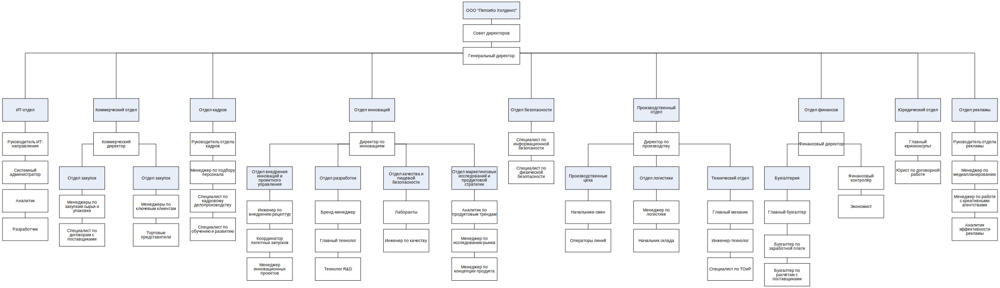
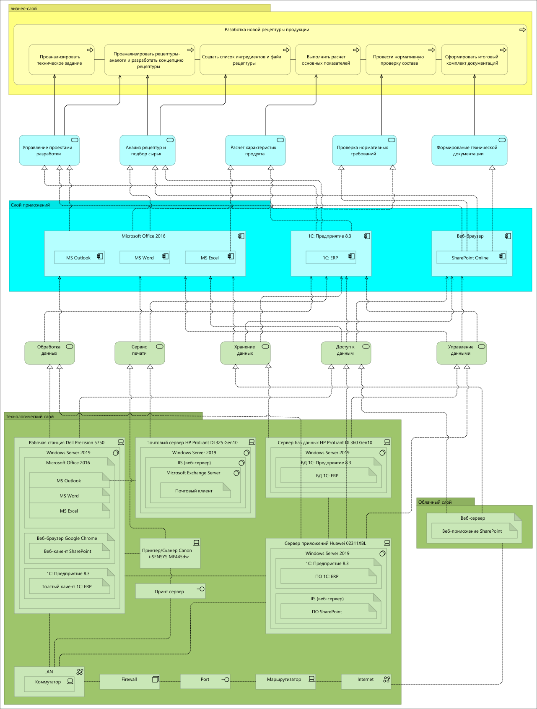
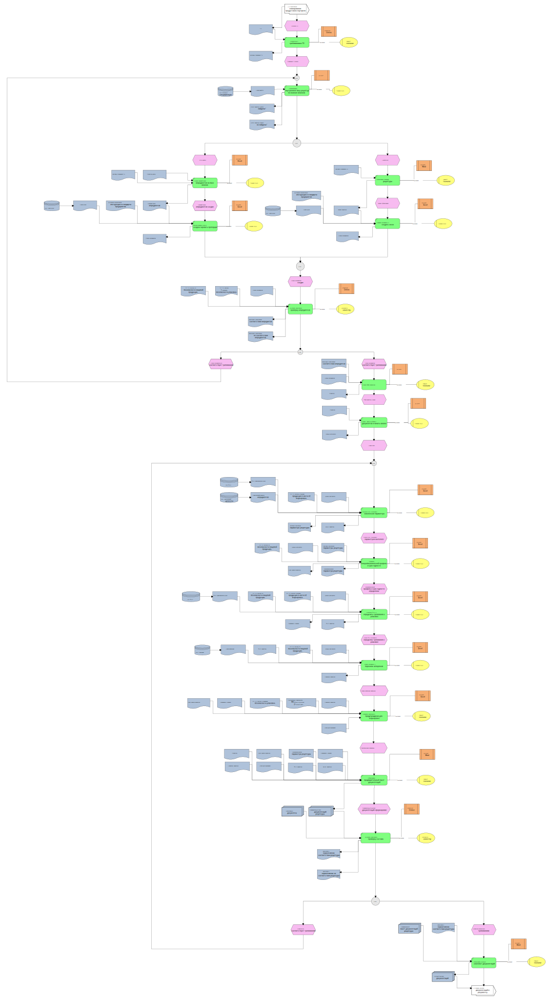

# PLM-система для ООО «ПепсиКо Холдингс»

**Объект:** ООО «ПепсиКо Холдингс» (подразделение PepsiCo Inc. в России и СНГ)  
**Период:** 2025–2026  
**Роль:** Системный аналитик  
**Контекст:** Курсовая научно-исследовательская работа (КНИР) + ВКР, НИТУ МИСИС

---

## Проблема
Процесс разработки новой рецептуры характеризовался высокой долей ручного труда и использованием разрозненных систем (Excel, локальные БД, SharePoint). Согласно анализу, это приводило к:
- **Высокому Time-to-Market:** средний цикл разработки составлял **40.46 дней**.
- **Рискам ошибок:** погрешности в расчётах КБЖУ и нормативных несоответствиях (ТР ТС).
- **Непрозрачности:** сложности в управлении версиями и отслеживании изменений данных.

## Цель
Спроектировать и внедрить PLM-систему для автоматизации полного жизненного цикла рецептуры — от обработки технического задания до формирования итогового пакета документации.

---

## Анализ предприятия

**ООО «ПепсиКо Холдингс»** — ведущее предприятие пищевой промышленности, производящее напитки, снеки, молочную продукцию и детское питание.

**Ключевые показатели (на 2024 г.):**
- Выручка: **254 015 506 тыс. руб.** (+21.43% к 2023 г.).
- Чистая прибыль: **43 374 800 тыс. руб.** (+25.44% к 2023 г.).

**Стратегические цели (4 перспективы BSC):**

| Перспектива | Цель |
|-------------|------|
| Финансы | Увеличить выручку на 20% к 2029 г. (база 2027 г.) |
| Клиенты | Увеличить рыночную долю на 5-10% к 2030 г. |
| Бизнес-процессы | Автоматизировать 80% внутренних процессов к 2031 г. |
| Развитие | Достичь 90% использования возобновляемой энергии к 2030 г. |

Организационная структура предприятия ниже:

---

## Архитектурные и процессные модели

### Архитектура предприятия «как есть» (ArchiMate)
Отображает текущий ландшафт ИТ-систем и их взаимодействие до внедрения PLM.

### Архитектура бизнес-процесса «как есть» (ArchiMate)

### Процессная модель «как есть» (EPC)
Детальное описание цепочки событий при разработке рецептуры вручную.

---

## Требования к системе

### Диаграмма прецедентов (Use Case)

### Акторы и прецеденты

| Актор | Прецеденты |
|-------|------------|
| Директор по инновациям | Просмотр итоговой рецептуры; Фиксация решения; Инициация разработки; Передача ТЗ |
| Главный технолог | Формирование концепции; Утверждение расчёта; Создание файла рецептуры; Корректировка состава |
| Технолог R&D | Создание рецептуры; Подбор ингредиентов; Запуск расчёта КБЖУ; Просмотр истории версий |
| Специалист по нормам | Проведение нормативной проверки; Формирование замечаний |

---

## Диаграмма классов
Описывает структуру данных PLM-системы, включая 17 ключевых сущностей (рецептуры, ингредиенты, показатели КБЖУ, нормативные документы). Модель поддерживает версионность и статусы («Черновик», «Утвержден»).

---

## Модель доступа

### Роли в системе
Управление доступом организовано по матричному принципу с разделением прав на функциональные модули.

| Роль | Тип | Описание |
|------|-----|----------|
| Директор по инновациям | Ключевой | Инициирует ТЗ, принимает финальное управленческое решение. |
| Главный технолог | Ключевой | Контроль НСИ, утверждение расчетов, управление документацией. |
| Технолог R&D | Основной | Работа «в полях»: ввод составов, проведение автоматических расчетов. |
| Специалист по нормам | Основной | Валидация на соответствие техрегламентам (ТР ТС 021/2011 и др.). |

### CRUD-матрица

| Объект системы | Директор | Гл. технолог | Технолог R&D | Специалист по нормам |
|----------------|:--------:|:------------:|:------------:|:--------------------:|
| Техническое задание | R | R | R | R |
| Файл рецептуры | R | C R U | C R U | R |
| Расчёт КБЖУ и ФХП | R | R | C R | R |
| Нормативная документация | R | C R U D | R | C R U |
| Управленческое решение | C R | R | — | — |
| История версий | R | R | R | R |

*C — создание, R — чтение, U — изменение, D — удаление*

### Правила доступа
- **Директор по инновациям:** не выполняет расчётов и не создаёт документацию.
- **Главный технолог:** обладает исключительным правом отклонить расчёт и отправить на пересчёт.
- **Технолог R&D:** не имеет доступа к блоку управленческих решений.

---

## 5. KPI процесса

| KPI | Текущее значение | Целевое значение |
|-----|-----------------|-----------------|
| Время разработки (TTM) | **40.46 дней** | Сокращение на 30% |
| Количество ошибок в расчётах | Высокое (ручной ввод) | Снижение до 0 (автоматизация) |
| Время согласования | — | Сокращение на 40% |
| Соответствие нормативам | Выборочный контроль | 100% (авто-проверка) |

---

## 6. План проекта внедрения

Проект реализуется по **инкрементной модели** жизненного цикла.
- **Общий бюджет:** 4 458 550 рублей.
- **Ставка по риску:** 46,5%.

### Этапы проекта
1. Системный анализ и моделирование «как есть» (IDEF0, ArchiMate, EPC).
2. Проектирование целевой архитектуры «как будет».
3. Разработка функциональных требований и ТЗ.
4. Выбор платформы и настройка ИТ-ландшафта.
5. Разработка физической модели данных (MySQL) и интеграций с 1С:ERP.
6. Тестирование, обучение пользователей и запуск в ОЭ.

---

## Используемые инструменты
`Visual Paradigm` `IDEF0 / IDEF1x` `BPMN` `ArchiMate` `UML Use Case` `MySQL` `YouGile` `draw.io`
